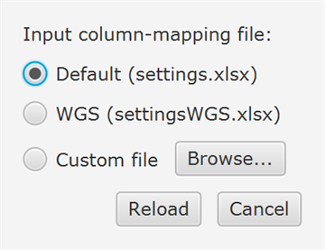
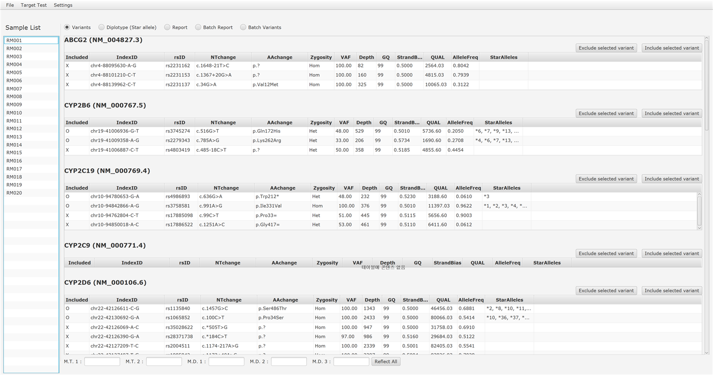
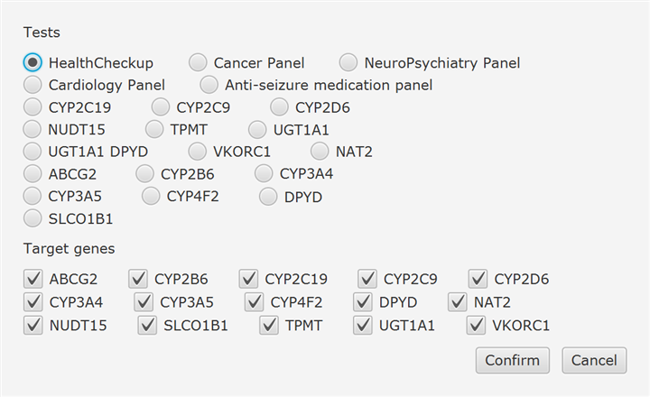
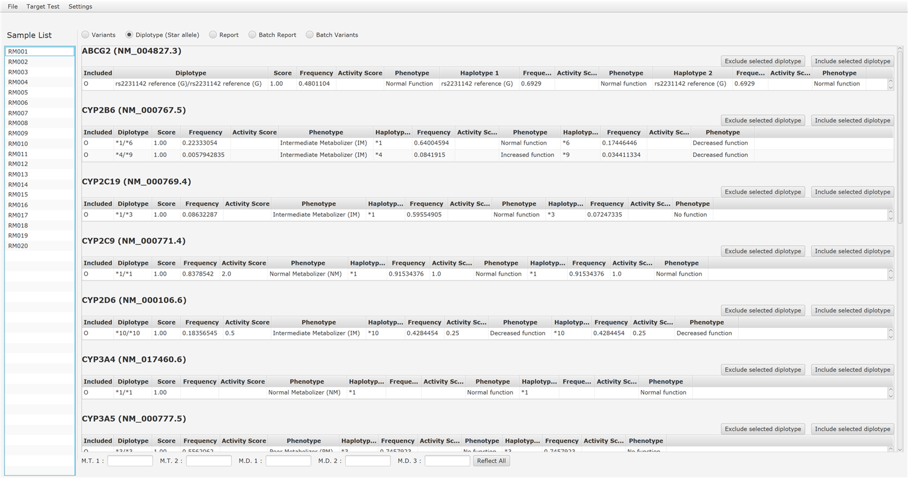
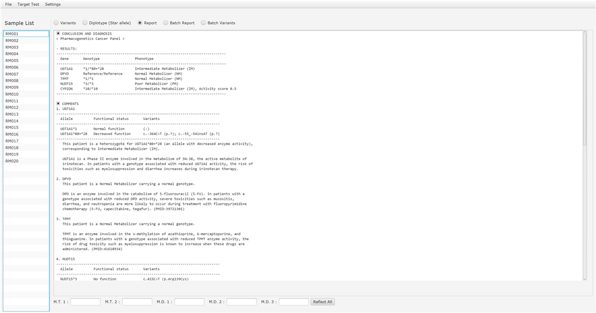

# SnackPGx

[](https://github.com/Young-gonKim/SnackPGx/releases)
[](LICENSE.txt)
<!-- DOI-BADGE: add Zenodo concept-DOI badge here after minting -->

**SnackPGx** is a desktop application for **pharmacogenetic (PGx) genotyping and clinical
report generation** from next-generation sequencing (NGS) annotation files. It converts
per-variant annotation tables into **star-allele diplotypes**, predicts **metabolizer
phenotypes**, and produces ready-to-use **clinical reports** for individual genes and for
disease-area test panels.

Allele definitions, allele functional status, diplotype–phenotype mappings, and population
allele frequencies are taken from the gene-specific information tables provided by
**[ClinPGx/PharmGKB](https://www.clinpgx.org)** and **[CPIC](https://cpicpgx.org)**.

> Developed by the Department of Laboratory Medicine & Genetics, Samsung Medical Center.
> Runs on Windows, macOS, and Linux (Java 17 / JavaFX). **Free for non-commercial use** — see [LICENSE.txt](LICENSE.txt).

---

## Table of contents
- [Features](#features)
- [Supported genes & test panels](#supported-genes--test-panels)
- [Installation](#installation)
- [Usage](#usage)
  - [1. Prepare the annotation file](#1-prepare-the-annotation-file)
  - [2. Configure input columns (settings file)](#2-configure-input-columns-settings-file)
  - [3. Load input files](#3-load-input-files)
  - [4. Select the target test / panel](#4-select-the-target-test--panel)
  - [5. Review results — Variants / Diplotype / Report](#5-review-results--variants--diplotype--report)
- [Important limitations (CYP2D6 CNV, HLA-A/B)](#important-limitations)
- [Building from source](#building-from-source)
- [Citation](#citation)
- [License](#license)

---

## Features
- Star-allele **diplotype calling** by minimum Jaccard distance between the observed
  variant set and each candidate diplotype's defining variant set.
- **Phenotype / activity-score** prediction from ClinPGx/CPIC tables.
- **Single-gene reports** and **panel reports** (Health Checkup, Cancer, NeuroPsychiatry,
  Cardiology, ASM).
- **Batch mode** — process many samples at once and export a per-sample × per-gene table.
- Adjustable **QC thresholds** (depth, VAF, QUAL) and selectable **input column mapping**
  for different annotation formats (e.g., targeted panel vs. WGS).
- Database is user-updatable: drop freshly downloaded ClinPGx tables into `gene_tables/`.

---

## Supported genes & test panels
**Genes (15):** ABCG2, CYP2B6, CYP2C19, CYP2C9, CYP2D6, CYP3A4, CYP3A5, CYP4F2, DPYD,
NAT2, NUDT15, SLCO1B1, TPMT, UGT1A1, VKORC1.

**Preset panels:**

| Panel | Genes |
|-------|-------|
| Health Checkup | all 15 genes |
| Cancer | CYP2D6, CYP3A4, CYP3A5, DPYD, NUDT15, TPMT, UGT1A1 |
| Cardiology | ABCG2, CYP2C9, CYP2C19, CYP2D6, CYP4F2, SLCO1B1, VKORC1 |
| NeuroPsychiatry | CYP2B6, CYP2C9, CYP2C19, CYP2D6, CYP3A4, CYP3A5 |
| Anti-seizure medication (ASM) | CYP2C9, CYP2C19 |

**Single-gene reports:** available for **each of the 15 genes** (and a combined
UGT1A1 + DPYD test).

> ⚠️ The **Health Checkup** and **Anti-seizure medication** reports also include
> **HLA-A / HLA-B** risk-allele rows (e.g., HLA-A\*31:01, HLA-B\*15:02). These results come
> from a **separate, dedicated HLA-typing assay** and are **entered manually** into the
> report for reference only — HLA typing is **outside the scope of SnackPGx**. Likewise,
> **CYP2D6 copy-number variation** requires a separate pipeline (see
> [Important limitations](#important-limitations)).

---

## Installation

### Option A — Portable build (Windows, recommended)
No Java installation required; a minimal Java runtime is bundled.

1. Download `SnackPGx-x.y.z-portable-win64.zip` from the **Releases** page.
2. Unzip to any folder.
3. Run **`SnackPGx.exe`**.

> If your security software blocks the unsigned launcher, use the bundled
> `SnackPGx.vbs` (or `SnackPGx (console).cmd`), which start the signed Java runtime
> directly.

### Option B — Run from source
Requires **JDK 17** (e.g., [Eclipse Temurin 17](https://adoptium.net/temurin/releases/?version=17)).
JavaFX and other dependencies are fetched automatically by Gradle.

```bash
git clone <this-repo>
cd SnackPGx
./gradlew run            # Windows: gradlew.bat run
```

---

## Usage

### 1. Prepare the annotation file
SnackPGx reads a **tab-separated annotation file** (one variant per row) produced by your
NGS pipeline — typically an ANNOVAR/SnpEff-style multi-anno table with one header row.

The columns SnackPGx needs are listed below. Their **position (column number) is configured
by you** in the settings file (next section), so any column layout is supported as long as
these fields exist.

| Field | Required | QC cutoff (default) | Example | Notes |
|-------|:--------:|:-------------------:|---------|-------|
| `gene` | ✅ | – | `NUDT15` | gene symbol |
| `indexID` | ✅ | – | `chr13-48037782-A-AGGAGTC` | **VCF-normalized** `chr-pos-ref-alt` (see below) |
| `NTchange` | ✅ | – | `c.50_55dupGAGTCG` | HGVS coding change |
| `AAchange` | ✅ | – | `p.Gly17_Val18dup` | HGVS protein change |
| `zygosity` | ✅ | – | `Het` / `Hom` | |
| `depth` | ✅ | ≥ 10 | `426` | read depth |
| `VAF` | ✅ | ≥ 25% | `0.5` | variant allele fraction |
| `QUAL` | ✅ | ≥ 300 | `8334.64` | call quality |
| `rsID` | optional | – | `rs869320766` | dbSNP ID |
| `transcript` | optional | – | `NM_018283.4` | RefSeq transcript |
| `GQ` | optional | – | `99` | genotype quality |
| `strandBias` | optional | – | `0.5069` | |
| `AF` | optional | – | `0.0466` | population allele frequency |

> QC cutoffs are defaults and can be changed at runtime in **Settings → Quality Parameters**.

#### ⚠️ Variant ID convention (important)
`indexID` must use the **VCF / `bcftools norm`-style** representation: left-aligned,
parsimonious, with an **anchoring reference base** for indels.

- ✅ Correct (VCF): `chr13-48037782-A-AGGAGTC`
- ❌ Not accepted (ANNOVAR `-`/coordinate-shift style): `chr13-48037783---GGAGTC`

The allele-defining variants from ClinPGx (HGVS `g.`) are internally normalized to the same
VCF representation using stored GRCh38 reference windows, so the input must match. If your
upstream output is ANNOVAR-style, normalize it to VCF `chr-pos-ref-alt` before loading.

### 2. Configure input columns (settings file)
The mapping between the fields above and the **column numbers** in your annotation file
lives in the settings workbook (`resources/settings.xlsx`, sheet **`input_file_format`**).
Each field is mapped to a 1-based column number; set a column to `0` to mark an optional
field as absent, and set **`Header row`** to the row that contains the header.

Two ready-made profiles are included and can be switched **without editing files** via
**Settings → Input Parameters** (or point to your own custom `.xlsx`):

<p align="center"></p>

- **Default (`settings.xlsx`)** — targeted PGx panel format
- **WGS (`settings_WGS.xlsx`)** — whole-genome multi-anno format

> If you load a file with the wrong profile selected (e.g., WGS mapping on panel data),
> SnackPGx shows a single notice: *"Please check input file type (Settings → Input Parameters)."*

### 3. Load input files
Use **File → New Project** and select one or more annotation `.txt` files (multi-select is
supported for batch processing). The sample ID is taken from the file name, and loaded
samples appear in the **Sample List** on the left.

<p align="center"></p>

### 4. Select the target test / panel
Open **Target Test → Target Test Selection**. Choose a **Test** (a single gene or a panel)
and adjust the **Target genes** to include in the analysis, then click **Confirm**. The
selected test determines which **Report** is generated.

<p align="center"></p>

### 5. Review results — Variants / Diplotype / Report
Switch between views using the radio buttons at the top of the window.

**Variants** — all called variants per gene (index ID, rsID, NT/AA change, zygosity, VAF,
depth, GQ, strand bias, QUAL, allele frequency, mapped star alleles). Variants can be
manually included/excluded.

<p align="center"></p>

**Diplotype (Star allele)** — candidate diplotypes with match score, frequency, activity
score, predicted phenotype, and per-haplotype detail.

<p align="center"></p>

**Report** — the clinical report for the selected test: conclusion/diagnosis, a results
table (gene, genotype, phenotype), and gene-by-gene interpretive comments. Reporting
staff/physician initials can be entered at the bottom and inserted with **Reflect All**.

<p align="center"></p>

> **Batch Report / Batch Variants** views summarize all loaded samples in a single table
> for high-throughput review and export.

---

## Important limitations
SnackPGx calls star alleles from **small variants (SNVs/indels)** present in the annotation
file. The following are **out of scope and require a separate, dedicated pipeline**:

- **CYP2D6 copy-number variation (CNV)** — gene deletions (`*5`), duplications/multiplications,
  and hybrid (CYP2D6–CYP2D7) structural rearrangements are **not** detected from the
  small-variant annotation file and must be determined by a CNV/structural-variant pipeline.
  The CYP2D6 result reflects only the SNV/indel-defined star alleles.
- **HLA-A and HLA-B typing** (e.g., HLA-B\*15:02, HLA-B\*57:01, HLA-A\*31:01) — requires a
  dedicated **HLA typing pipeline** and is not produced by SnackPGx.

Results should always be interpreted by a qualified professional together with these
orthogonal analyses where clinically relevant.

---

## Building from source
- **Build tool:** Gradle (wrapper included — `gradlew` / `gradlew.bat`)
- **JDK:** 17 (a JavaFX-free distribution such as Eclipse Temurin 17 is recommended)
- **Key dependencies:** OpenJFX 17 (UI), Apache POI 5 (Excel I/O)

```bash
./gradlew run            # compile and launch
./gradlew jpackageImage  # build a self-contained app image
./gradlew jpackage       # build a native installer (Windows .msi needs WiX Toolset 3.x)
```

Runtime data directories `resources/` and `gene_tables/` are bundled next to the application
and located via `-Dapp.dir=$APPDIR` in the packaged build. To update the knowledge base,
replace the ClinPGx `.xlsx` files in `gene_tables/`.

---

## Citation
If you use SnackPGx in your research, please cite the archived release:

<!-- CITATION-DOI: after minting, replace ZENODO_CONCEPT_DOI with the "Cite all versions" concept DOI -->
> Kim, Young-gon. *SnackPGx: pharmacogenetic genotyping and clinical report generation from NGS data*. Zenodo. https://doi.org/ZENODO_CONCEPT_DOI

A machine-readable [`CITATION.cff`](CITATION.cff) is included, so GitHub's **"Cite this repository"** button can generate APA/BibTeX automatically. The DOI above is the **concept DOI**, which always resolves to the latest version; each release also has its own version-specific DOI.

---

## License
**Free for non-commercial use.** See [**LICENSE.txt**](LICENSE.txt) for the full terms.
Commercial use requires a separate agreement with the authors. SnackPGx is provided for
research/informational purposes and is **not** a certified diagnostic device.
